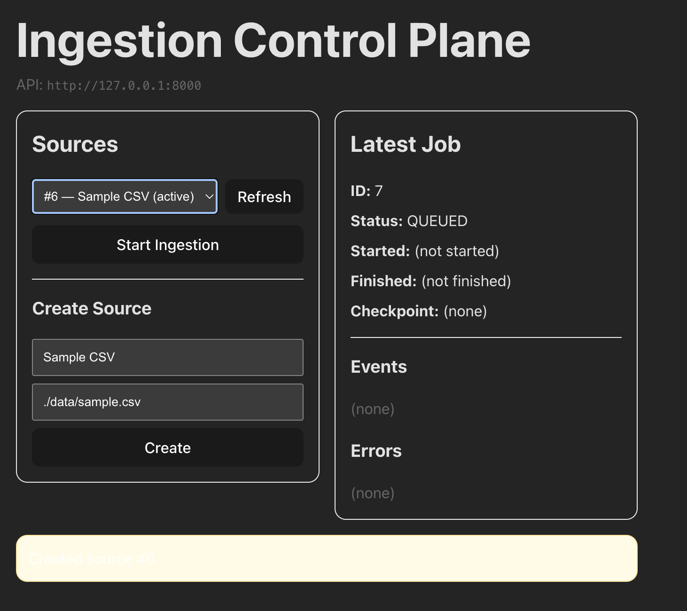

# 🚀 Ingestion Control Plane

A full-stack system for running, monitoring, and debugging data ingestion jobs inspired by production data platforms used at companies like Stripe, Airbnb, and Databricks.

This project implements a **control-plane architecture** that manages:
- Data sources
- Ingestion jobs
- Job state & checkpoints
- Progress events
- Error reporting
- A live web dashboard

---

## 📊 Dashboard

---

## 🧠 What it does

Users can:
1. Register CSV data sources
2. Start ingestion jobs
3. Run background workers that process data
4. Track real-time progress
5. Inspect errors and checkpoints
6. Monitor everything via a React dashboard

---

## 🏗 Architecture

React Dashboard  →  FastAPI Control Plane  →  SQLite DB
                            ↑
                        Python Worker

---

## 🔌 APIs

| Endpoint | Description |
|--------|-------------|
| POST /sources | Register a data source |
| GET /sources | List all sources |
| POST /sources/{id}/ingestions | Start a job |
| GET /ingestions/{id} | Job status |
| GET /ingestions/{id}/events | Progress events |
| GET /ingestions/{id}/errors | Failure reports |

---

## ⚙️ Run Locally

cd ~/ingestion-control-plane
source .venv/bin/activate
uvicorn api.main:app --reload

### Start the Worker

python worker/worker.py

### Start the dashboard

cd ~/ingestion-control-plane/dashboard
rm -rf node_modules/.vite
npm run dev

